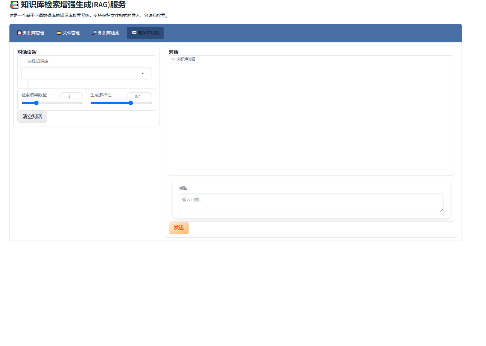

# EasyRAG - 轻量级本地知识库增强系统

[中文](README.md) | [English](README_EN.md)

## 项目简介

EasyRAG是一个灵活、易用的本地知识库增强问答系统。它集成了先进的检索技术和多样化的大语言模型（LLM），能帮助用户快速构建、查询和管理本地知识库，实现精准、智能的问答体验。系统支持混合搜索、重排序和多种模型切换，所有功能均可在本地部署，确保数据安全与私密性。

## 界面预览

### 主界面


### 文件上传


### 知识库检索


### 智能对话


## 主要功能

- **知识库管理**：支持创建、更新和删除知识库。
- **多格式文档处理**：支持PDF、Word、Markdown、文本等多种格式，并集成OCR功能识别图片中的文字。
- **高级检索策略**：
  - **混合搜索 (Hybrid Search)**：结合向量检索与关键词检索（BM25），提升召回率和准确性。
  - **重排序 (Reranking)**：集成重排模型，对检索结果进行二次排序，优化答案相关性。
- **灵活的模型支持**：
  - **本地大模型**：无缝集成DeepSeek, Qwen, Yi等多种主流开源大模型。
  - **API模型**：支持通过API密钥调用外部模型服务（如GPT, Claude等）。
- **智能问答与对话**：
  - 结合知识库内容生成准确、自然的回答。
  - 支持上下文感知的多轮对话。
- **多样化分块策略**：支持多种文档分块方法，包括语义分块、递归字符分块，以及专为技术文档优化的子标题分块。
- **一键化本地部署**：提供Docker、Windows/Linux脚本等多种部署方式，实现全流程自动化，保障数据安全。
- **模型参数可调**：在Web界面中开放LLM参数调整，方便用户定制生成效果。

## 系统要求

- 操作系统：Windows/Linux/MacOS
- **推荐部署方式**：Docker 和 Docker Compose
- Python版本（手动安装）：Python 3.9+
- 内存：至少8GB（推荐16GB以上，取决于所用模型大小）
- 磁盘空间：至少需要10GB可用空间（用于存放模型和知识库）
- GPU（可选）：支持CUDA的NVIDIA GPU可大幅提升模型推理性能。

## 快速开始

### Docker一键部署 (推荐)

1.  确保已安装 [Docker](https://www.docker.com/get-started) 和 [Docker Compose](https://docs.docker.com/compose/install/)。
2.  在项目根目录下，执行命令：
    ```bash
    docker-compose up --build -d
    ```
3.  服务启动后，即可在浏览器中访问 `http://localhost:7861`。

### 脚本部署

#### Windows用户

1.  双击`deploy.bat`文件。
2.  脚本会自动检查Python环境，创建虚拟环境并安装所需依赖。
3.  自动启动API服务器和Web界面。

#### Linux/Unix用户

1.  打开终端，进入项目目录。
2.  给脚本添加执行权限：`chmod +x deploy.sh`
3.  运行脚本：`./deploy.sh`
4.  脚本会自动检查环境，安装依赖并启动服务。

### 手动安装

1.  确保安装了Python 3.9或更高版本。
2.  创建虚拟环境：`python -m venv venv`
3.  激活虚拟环境：
    - Windows: `venv\Scripts\activate`
    - Linux/Mac: `source venv/bin/activate`
4.  安装依赖：
    - CPU版本：`pip install -r requirements_cpu.txt`
    - GPU版本：`pip install -r requirements_gpu.txt`
5.  启动服务：
    - API服务器：`python app.py`
    - Web界面：`python ui_new.py`

### 重要说明：Faiss安装

**注意**：对于手动或脚本安装，Faiss向量库可能因编译问题安装失败。Docker部署已包含此依赖。

- CPU版本：`pip install faiss-cpu`
- GPU版本：`pip install faiss-gpu`

如果安装失败，请参考官方文档或尝试使用预编译包。

## 使用说明

启动服务后，在浏览器中访问以下地址：

- Web界面：`http://localhost:7861`
- API文档：`http://localhost:8000/docs`

### 创建知识库

1.  访问Web界面，选择"知识库管理"选项卡。
2.  点击"创建知识库"，输入知识库名称，并选择Embedding模型和分块策略。
3.  上传文档（支持拖拽）或粘贴文本。
4.  系统会自动处理文档并构建索引。

### 使用知识库问答

1.  选择"知识库对话"选项卡。
2.  在左侧选择已创建的知识库。
3.  在右侧选择对话使用的大语言模型，并按需调整检索策略（如混合搜索）和模型参数（如温度）。
4.  输入问题并发送，系统将生成回答。

## 系统架构

- `docker-compose.yml`：Docker部署配置文件
- `app.py`：后端FastAPI服务
- `ui_new.py`：前端Gradio用户界面
- `core/`：核心功能模块
  - `kb_doc_process.py`：文档处理与分块模块（含OCR）
  - `kb_retriever.py`：检索模块（向量、关键词、混合搜索）
  - `kb_reranker.py`：重排模块
  - `llm_interface.py`：统一的大语言模型接口（本地与API）
- `deploy.bat`/`deploy.sh`：自动化部署脚本

## 技术细节

### 模型支持

- **Embedding模型**：默认为`bge-m3`，支持切换其他Sentence-Transformer模型，用于将文本向量化。
- **大语言模型 (LLM)**：默认使用`DeepSeek-Chat-1.5B-Base`，同时支持通过HuggingFace加载`Qwen`, `Yi`等主流开源模型。也支持配置API Key使用外部模型。
- **重排模型 (Reranker)**：默认使用`bge-reranker-base`，用于在检索后对结果进行精排序，提升精度。

所有本地模型在首次使用时会自动从网络下载并缓存。

### 检索与分块

- **检索策略**：支持向量检索、关键词检索（BM25）和混合搜索。用户可在对话时灵活选择。
- **文档分块策略**：系统支持多种文档分块策略，适用于不同类型的文档：
  - **语义分块**：根据语义边界划分文档，适合一般文本。
  - **递归字符分块**：基于字符级别的分块，适合非结构化文本。
  - **Markdown标题分块**：基于Markdown标题的分块。
  - **子标题分块**：专为技术文档和白皮书设计，按小标题分块同时保留大标题信息，便于精确检索。

## 问题排查

如遇到问题，请检查：

1.  **Docker用户**：检查Docker服务是否正常运行。
2.  **手动/脚本用户**：
    - 网络连接是否正常（首次运行需要下载模型）。
    - 磁盘空间是否充足（至少需要10GB可用空间）。
    - 查看命令行窗口中的错误信息。
    - 检查Faiss是否成功安装（`pip list | grep faiss`）。

### 常见问题解决方案

#### 1. OpenCV依赖错误 (Linux手动安装)

如果遇到`ImportError: libGL.so.1: cannot open shared object file`错误，说明缺少OpenCV的图形库依赖。

**Ubuntu/Debian系统**：