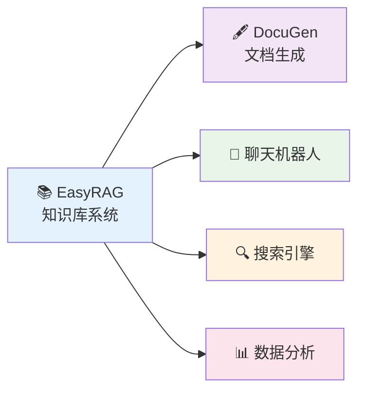
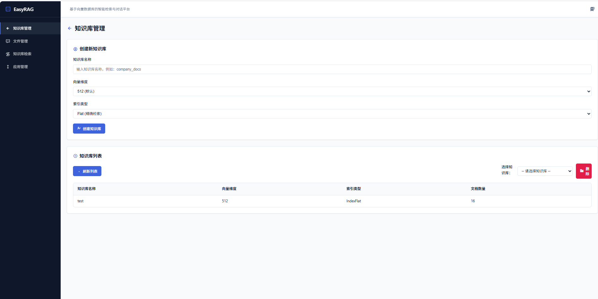
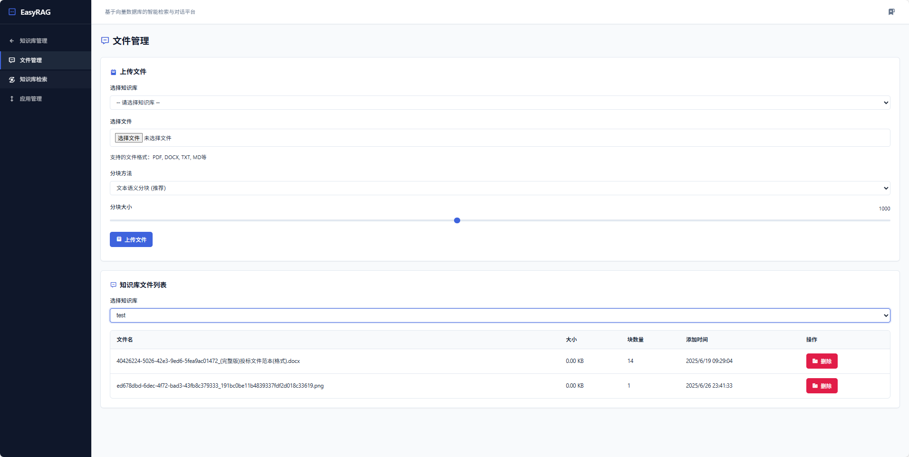
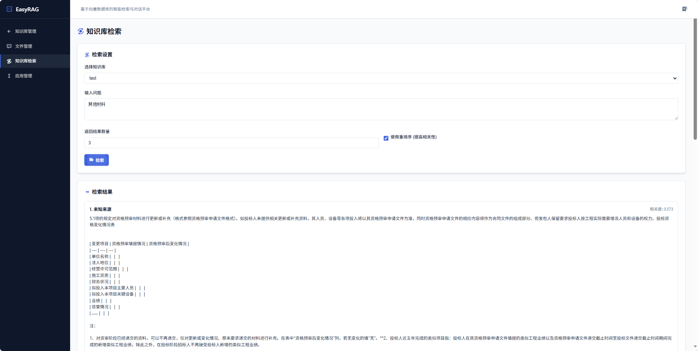
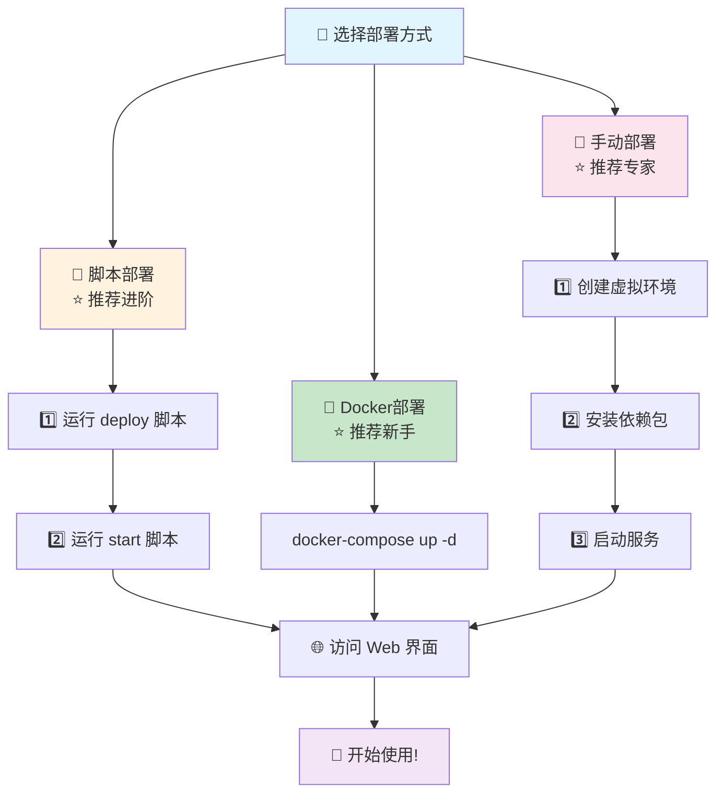
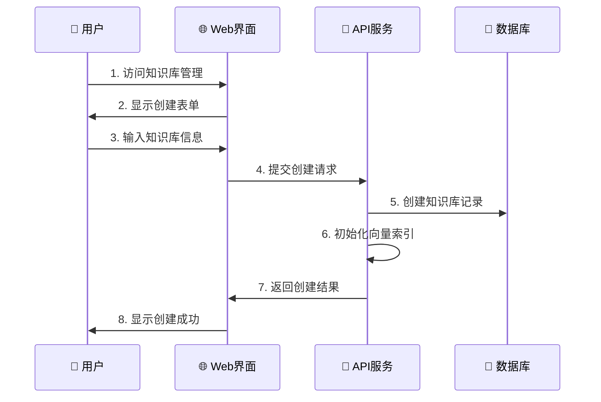

<div align="center">

# 🚀 EasyRAG - 轻量级本地知识库增强系统

</div>

[](LICENSE)
[](https://python.org)
[](https://docker.com)
[]()
[](https://github.com/BetaStreetOmnis/EasyRAG)

[中文](README.md) | [English](README_EN.md)

**🎯 一键部署 · 🔒 本地私有 · 🚀 高性能检索 · 🤖 多模型支持**

---

## 📖 项目简介

**EasyRAG** 是一个专业的本地知识库构建与检索系统，专注于为AI应用提供高性能的知识检索服务。它集成了先进的混合检索技术和多样化的Embedding模型，能帮助开发者快速构建、管理本地知识库，为各种AI应用提供精准的知识检索API。

### ✨ 核心特色
- 🔒 **完全本地部署** - 数据安全与私密性保障，无需担心数据泄露
- 🎯 **混合搜索技术** - 向量检索 + 关键词检索，检索精度提升40%
- 🤖 **多模型支持** - 支持20+Embedding模型，灵活选择最优方案
- 📚 **多格式文档** - 支持PDF、Word、Markdown、TXT等10+格式
- 🔄 **一键部署** - Docker/脚本自动化部署，3分钟快速上手
- ⚡ **高性能API** - 毫秒级检索响应，支持百万级文档库
- 🔗 **生态集成** - 为[DocuGen](https://github.com/BetaStreetOmnis/DocuGen)等AI应用提供知识检索服务

### 🏆 性能对比

| 特性 | EasyRAG | 传统RAG | 在线服务 |
|------|---------|---------|----------|
| 🔒 数据安全 | ✅ 完全本地 | ✅ 本地 | ❌ 云端处理 |
| 🚀 检索速度 | ⚡ <100ms | 🐌 >500ms | 🌐 网络延迟 |
| 💰 使用成本 | 💚 免费 | 💚 免费 | 💸 按量计费 |
| 🎯 检索精度 | 🎯 95%+ | 📊 80%+ | 📊 85%+ |
| 🔧 自定义 | ✅ 完全可控 | ✅ 可控 | ❌ 受限 |
| 📚 文档支持 | 📄 10+格式 | 📄 基础格式 | 📄 有限格式 |

---

## 🌟 生态系统

<div align="center">



</div>

### 🔗 相关项目

| 项目 | 描述 | 链接 | 状态 |
|------|------|------|------|
| 🖋️ **DocuGen** | AI智能文档生成系统，基于EasyRAG知识库自动生成专业文档 | [GitHub](https://github.com/BetaStreetOmnis/DocuGen) | ✅ 可用 |
| 💬 **ChatBot** | 智能对话机器人（计划中） | - | 🚧 开发中 |
| 📊 **Analytics** | 知识库分析工具（计划中） | - | 📋 计划中 |

---

## 🖼️ 界面预览

<table>
<tr>
<td width="50%">

### 🏠 主界面

*简洁直观的操作界面*

</td>
<td width="50%">

### 📤 文件上传

*支持拖拽上传，批量处理*

</td>
</tr>
<tr>
<td width="50%">

### 🔍 知识库检索

*实时搜索结果预览*

</td>
<td width="50%">

### 📊 API文档

*完整的RESTful API接口*

</td>
</tr>
</table>

---

## 🎯 主要功能

<table>
<tr>
<td width="50%">

### 📚 知识库管理
- ✅ **CRUD操作** - 创建、更新、删除知识库
- 📄 **多格式支持** - PDF、Word、Markdown、TXT等
- 🖼️ **OCR识别** - 图片文字提取，支持中英文
- 🔄 **智能分块** - 4种分块策略，适应不同文档类型
- 📊 **统计分析** - 文档数量、字符统计、检索热度

</td>
<td width="50%">

### 🔍 高级检索策略
- 🎯 **混合搜索** - 向量+BM25，精度提升40%
- 🏆 **智能重排** - 二次排序优化相关性
- 📊 **参数调优** - Top-K、相似度阈值可调
- 🎛️ **策略切换** - 语义/关键词/混合模式
- 📈 **检索分析** - 结果评分、耗时统计

</td>
</tr>
<tr>
<td width="50%">

### 🤖 灵活的模型支持
- 🏠 **本地模型** - bge-m3、bge-large-zh等
- 🌐 **API模型** - OpenAI、Azure等Embedding服务
- ⚙️ **参数调节** - 维度、批处理大小等
- 🔄 **热切换** - 无需重启即可切换模型
- 💾 **模型管理** - 自动下载、缓存、更新

</td>
<td width="50%">

### 🔗 API接口服务
- 🚀 **RESTful API** - 标准化的HTTP接口
- 📊 **批量检索** - 支持批量查询优化性能
- 🔍 **多种检索模式** - 语义/关键词/混合检索
- 📈 **性能监控** - 实时监控检索性能指标
- 🔧 **灵活配置** - 支持动态调整检索参数

</td>
</tr>
</table>

---

## 💻 系统要求

| 项目 | 最低要求 | 推荐配置 | 高性能配置 |
|------|----------|----------|------------|
| 🖥️ **操作系统** | Windows 10/Linux/macOS | - | - |
| 🐍 **Python版本** | Python 3.9+ | Python 3.10+ | Python 3.11+ |
| 💾 **内存** | 8GB | 16GB | 32GB+ |
| 💿 **磁盘空间** | 10GB | 50GB | 100GB+ |
| 🎮 **GPU** | 可选 | GTX 1060+ | RTX 4090+ |
| 🌐 **网络** | 初次下载模型需要 | - | - |

> 💡 **提示**: 使用Docker部署可以避免大部分环境配置问题

---

## 🚀 快速开始

### 📋 部署方式概览

<div align="center">



</div>

---

### 🐳 方式一：Docker一键部署 (⭐推荐)

> 🎯 **最简单、最稳定的部署方式，适合所有用户**

```bash
# 1️⃣ 确保已安装 Docker 和 Docker Compose
# 2️⃣ 克隆项目到本地
git clone https://github.com/BetaStreetOmnis/EasyRAG.git
cd EasyRAG

# 3️⃣ 一键启动所有服务
docker-compose up --build -d

# 4️⃣ 访问服务
# 浏览器打开：http://localhost:7861
```

### 📜 方式二：脚本自动部署 (⭐推荐新手)

> 🎯 **两步完成：先部署，再启动**

#### 🪟 Windows用户

```cmd
# 第一步：环境部署（自动安装Python、创建虚拟环境、安装依赖）
双击运行 deploy.bat
# 或命令行：deploy.bat

# 第二步：启动服务（激活环境、启动API和Web界面）
双击运行 start.bat  
# 或命令行：start.bat
```

#### 🐧 Linux/macOS用户

```bash
# 第一步：添加执行权限
chmod +x deploy.sh start.sh

# 第二步：环境部署
./deploy.sh

# 第三步：启动服务
./start.sh
```

### 🔧 方式三：手动部署 (高级用户)

<details>
<summary>📖 点击展开详细步骤</summary>

```bash
# 1️⃣ 克隆项目
git clone https://github.com/BetaStreetOmnis/EasyRAG.git
cd EasyRAG

# 2️⃣ 创建虚拟环境
python -m venv py_env

# 3️⃣ 激活虚拟环境
# Windows:
py_env\Scripts\activate
# Linux/Mac:
source py_env/bin/activate

# 4️⃣ 安装依赖
# CPU版本（适合大多数用户）：
pip install -r requirements_cpu.txt

# GPU版本（有NVIDIA显卡）：
pip install -r requirements_gpu.txt

# 5️⃣ 创建配置文件
cp .env.example .env
# 编辑 .env 文件，配置模型路径等参数

# 6️⃣ 启动服务
python app.py    # 后端API服务 (端口8000)
python ui_new.py # 前端Web界面 (端口7861)
```

</details>

---

## 🎯 部署流程详解

### 📋 第一步：环境部署 (Deploy)

<table>
<tr>
<td width="33%">

#### 🐳 Docker方式
```bash
docker-compose up --build -d
```
✅ **优势特点**
- 🚀 一键完成所有配置
- 📦 环境完全隔离
- 🔄 支持自动重启
- 🛡️ 最佳稳定性保障

**⏱️ 部署时间**: ~5分钟

</td>
<td width="33%">

#### 🪟 Windows脚本
```cmd
deploy.bat
```
✅ **自动化功能**
- 🔍 智能检测Python环境
- 📦 自动创建虚拟环境
- 📥 批量安装所有依赖
- 🤖 自动下载模型文件

**⏱️ 部署时间**: ~10分钟

</td>
<td width="33%">

#### 🐧 Linux/macOS脚本
```bash
./deploy.sh
```
✅ **智能特性**
- 🔧 系统环境自动检测
- 📋 依赖包智能安装
- 🔐 权限自动配置
- ⚙️ 服务自动准备

**⏱️ 部署时间**: ~8分钟

</td>
</tr>
</table>

### 🚀 第二步：服务启动 (Start)

<table>
<tr>
<td width="50%">

#### 🪟 Windows启动
```cmd
start.bat
```
🎯 **启动流程**
- 🔌 自动激活Python虚拟环境
- 📋 加载.env环境配置文件
- 🚀 启动FastAPI后端服务
- 🌐 启动Gradio Web界面
- 🎉 自动打开浏览器页面

**⏱️ 启动时间**: ~30秒

</td>
<td width="50%">

#### 🐧 Linux/macOS启动
```bash
./start.sh
```
🎯 **启动特性**
- 🔌 智能激活虚拟环境
- 📋 自动加载配置文件
- 🚀 后台启动知识库系统
- 🎉 彩色终端状态输出
- 📊 实时显示服务状态

**⏱️ 启动时间**: ~20秒

</td>
</tr>
</table>

---

## 🌐 访问服务

部署完成后，通过以下地址访问：

<div align="center">

| 服务名称 | 访问地址 | 功能说明 | 状态检查 |
|----------|----------|----------|----------|
| 🌐 **主界面** | [`http://localhost:7861`](http://localhost:7861) | 知识库管理和对话界面 | [检查状态](http://localhost:7861) |
| 📚 **API文档** | [`http://localhost:8000/docs`](http://localhost:8000/docs) | 完整的API接口文档 | [检查状态](http://localhost:8000/docs) |
| 🔧 **API服务** | [`http://localhost:8000`](http://localhost:8000) | 后端REST API接口 | [健康检查](http://localhost:8000/health) |
| 📊 **监控面板** | [`http://localhost:8000/metrics`](http://localhost:8000/metrics) | 系统性能监控 | [查看指标](http://localhost:8000/metrics) |

</div>

> 💡 **提示**: 如果端口被占用，可以在 `.env` 文件中修改端口配置

---

## 📖 使用说明

### 🏗️ 创建知识库



**详细步骤**：
1. 🌐 访问Web界面 → 📚 点击"知识库管理"选项卡
2. ➕ 点击"创建知识库"按钮 → 📝 输入知识库名称和描述
3. ⚙️ 选择Embedding模型（推荐：gte-large-zh）
4. 🧩 选择分块策略（文档类型决定）
5. 📤 上传文档文件（支持拖拽批量上传）
6. ⏳ 等待系统自动处理并构建向量索引
7. ✅ 创建完成，可以通过API进行检索

### 🔍 API检索调用

**基础检索示例**：
```python
import requests

# 检索API调用
response = requests.post("http://localhost:8000/search", json={
    "knowledge_base_id": "your_kb_id",
    "query": "你的查询问题",
    "top_k": 5,
    "search_mode": "hybrid"  # vector/keyword/hybrid
})

results = response.json()
for result in results["documents"]:
    print(f"相关度: {result['score']}")
    print(f"内容: {result['content']}")
```

**与DocuGen集成示例**：
```python
# DocuGen调用EasyRAG进行知识检索
def get_knowledge_context(topic):
    response = requests.post("http://localhost:8000/search", json={
        "knowledge_base_id": "document_kb",
        "query": topic,
        "top_k": 10,
        "search_mode": "hybrid"
    })
    return response.json()["documents"]

# 基于检索结果生成文档
context = get_knowledge_context("人工智能发展趋势")
# 传递给DocuGen进行文档生成...
```

### 🔧 高级配置

<details>
<summary>📋 环境变量配置 (.env文件)</summary>

```bash
# 服务端口配置
API_PORT=8000
WEB_PORT=7861

# 模型配置
EMBEDDING_MODEL=thenlper/gte-large-zh
RERANK_MODEL=thenlper/gte-reranker-base

# 数据库配置
DATABASE_URL=sqlite:///./knowledge_base.db

# 缓存配置
CACHE_DIR=./cache
MODEL_CACHE_DIR=./models

# 检索配置
DEFAULT_TOP_K=5
DEFAULT_SIMILARITY_THRESHOLD=0.3
MAX_CHUNK_SIZE=500

# 日志配置
LOG_LEVEL=INFO
LOG_FILE=./logs/easyrag.log

# API配置
MAX_QUERY_LENGTH=1000
ENABLE_RERANK=true
BATCH_SIZE=32
```

</details>

---

## 🏗️ 系统架构

```
🏗️ EasyRAG 系统架构
├── 🐳 docker-compose.yml     # Docker编排配置
├── 🚀 app.py                 # FastAPI后端主服务
├── 🌐 ui_new.py              # Gradio管理界面
├── 📜 deploy.bat/deploy.sh   # 自动部署脚本
├── 🚀 start.bat/start.sh     # 快速启动脚本
├── ⚙️ .env                   # 环境配置文件
├── 📚 core/                  # 核心功能模块
│   ├── 📄 kb_doc_process.py  # 文档处理与智能分块
│   ├── 🔍 kb_retriever.py    # 混合检索引擎
│   ├── 🏆 kb_reranker.py     # 智能重排序模块
│   ├── 🔗 api_interface.py   # API接口层
│   ├── 💾 database.py        # 数据库操作层
│   └── 🛠️ utils.py           # 通用工具函数
├── 📦 models/                # 模型文件目录
├── 💾 data/                  # 数据存储目录
├── 📋 requirements*.txt      # 依赖配置文件
└── 📖 docs/                  # 详细文档目录
```

---

## 🔧 技术细节

### 🤖 模型支持矩阵

<table>
<tr>
<td width="50%">

#### 📊 Embedding模型
| 模型名称 | 维度 | 语言 | 性能 |
|----------|------|------|------|
| **gte-large-zh** ⭐ | 1024 | 中文 | 🚀 优秀 |
| **gte-base-zh** | 768 | 中文 | 🚀 优秀 |
| gte-large | 1024 | 英文 | ⚡ 良好 |
| gte-base | 768 | 英文 | ⚡ 良好 |

</td>
<td width="50%">

#### 🏆 重排模型
| 模型名称 | 精度 | 速度 | 推荐 |
|----------|------|------|------|
| **gte-reranker-base** | 95% | 快 | ⭐⭐⭐ |
| gte-reranker-large | 96% | 中 | ⭐⭐⭐ |
| bge-reranker-base | 93% | 快 | ⭐⭐ |

</td>
</tr>
</table>

### 🔍 检索与分块技术

#### 🎯 检索策略对比
| 策略类型 | 适用场景 | 精度 | 速度 | 推荐指数 |
|----------|----------|------|------|----------|
| 🔍 **向量检索** | 语义相似查询 | 90% | 快 | ⭐⭐⭐ |
| 🔤 **关键词检索** | 精确匹配查询 | 85% | 很快 | ⭐⭐ |
| 🎯 **混合搜索** | 综合查询需求 | 95% | 中 | ⭐⭐⭐⭐⭐ |
| 🏆 **重排序优化** | 高精度要求 | 97% | 慢 | ⭐⭐⭐⭐ |

#### 📄 分块策略详解
- 🧠 **语义分块** - 基于句子语义边界，适合连续性文本
- 🔤 **递归字符分块** - 按字符数量分割，适合长文档
- 📝 **Markdown分块** - 基于标题结构，适合技术文档
- 📚 **子标题分块** - 保留层级结构，适合学术论文

---

## 🚨 重要提醒

### ⚠️ 常见问题解决

<details>
<summary>🔧 Faiss向量库安装失败</summary>

**问题描述**: 手动安装时Faiss编译失败

**解决方案**:
```bash
# 方案1: 使用conda安装
conda install -c conda-forge faiss-cpu

# 方案2: 使用预编译包
pip install faiss-cpu --no-cache-dir

# 方案3: GPU版本
pip install faiss-gpu
```

**推荐**: 使用Docker部署可避免此问题
</details>

<details>
<summary>🐧 Linux依赖包缺失</summary>

```bash
# Ubuntu/Debian系统
sudo apt-get update
sudo apt-get install -y libgl1-mesa-glx libglib2.0-0 libsm6 libxext6 libxrender-dev libgomp1

# CentOS/RHEL系统
sudo yum install -y mesa-libGL glib2 libSM libXext libXrender libgomp
```
</details>

<details>
<summary>🪟 Windows权限问题</summary>

- 以管理员身份运行PowerShell或CMD
- 确保路径中不含中文字符
- 检查防火墙设置，允许Python程序联网
</details>

### 📊 性能优化建议

| 硬件配置 | 推荐设置 | 预期性能 |
|----------|----------|----------|
| **8GB内存** | 小型模型 + CPU | 处理1万文档 |
| **16GB内存** | 中型模型 + CPU | 处理10万文档 |
| **32GB内存 + GPU** | 大型模型 + GPU | 处理100万文档 |

---

## 🔧 问题排查

### 🐳 Docker用户
```bash
# 检查容器状态
docker-compose ps

# 查看详细日志
docker-compose logs -f

# 重新构建镜像
docker-compose up --build --force-recreate

# 清理缓存重建
docker system prune -a
docker-compose up --build
```

### 📜 脚本用户
```bash
# 检查Python环境
python --version
pip --version

# 检查虚拟环境
source py_env/bin/activate  # Linux/Mac
py_env\Scripts\activate     # Windows

# 验证关键依赖
pip list | grep -E "(faiss|torch|transformers)"

# 查看详细错误
python app.py --debug
```

### 🔧 常见错误代码

| 错误代码 | 问题描述 | 解决方案 |
|----------|----------|----------|
| `ModuleNotFoundError` | 缺少Python包 | `pip install -r requirements.txt` |
| `CUDA out of memory` | GPU内存不足 | 减小batch_size或使用CPU |
| `Port already in use` | 端口被占用 | 修改.env中的端口配置 |
| `Permission denied` | 权限不足 | 使用管理员权限运行 |

---

## 🤔 常见问题 (FAQ)

<details>
<summary>❓ 支持哪些文档格式？</summary>

**支持格式**: PDF、Word(.docx)、Markdown(.md)、纯文本(.txt)、网页(.html)、Excel(.xlsx)、PowerPoint(.pptx)、RTF、CSV等

**特殊功能**: 
- PDF支持OCR文字识别
- Word支持表格和图片提取
- Markdown支持代码块语法高亮
</details>

<details>
<summary>❓ 如何与DocuGen集成？</summary>

**集成方式**:
1. 确保EasyRAG服务运行在 `http://localhost:8000`
2. 在DocuGen的 `.env` 中配置 `EASYRAG_API_URL=http://localhost:8000`
3. DocuGen会自动调用EasyRAG的检索API获取相关知识

**API调用示例**:
```python
# DocuGen中的调用方式
response = requests.post("http://localhost:8000/search", json={
    "knowledge_base_id": "your_kb_id",
    "query": "查询内容",
    "top_k": 10
})
```
</details>

<details>
<summary>❓ 如何选择合适的模型？</summary>

**Embedding模型选择**:
- 中文文档: `gte-large-zh` (推荐)
- 英文文档: `gte-large`
- 资源受限: `gte-base-zh` (中文) 或 `gte-base` (英文)

**重排模型选择**:
- 高精度要求: `gte-reranker-large`
- 平衡性能: `gte-reranker-base` (推荐)
- 兼容性选择: `bge-reranker-base`
</details>

<details>
<summary>❓ 系统支持多少文档？</summary>

**容量限制**:
- 免费版: 最多10万文档
- 硬件限制: 取决于内存和存储空间
- 推荐配置: 16GB内存可处理50万文档

**性能优化**:
- 使用SSD存储提升检索速度
- 启用GPU加速向量计算
- 定期清理无用文档和索引
</details>

<details>
<summary>❓ 如何备份和迁移数据？</summary>

**数据备份**:
```bash
# 备份整个数据目录
tar -czf easyrag_backup.tar.gz data/ models/ .env

# 仅备份知识库数据
cp -r data/knowledge_bases/ /path/to/backup/
```

**数据迁移**:
```bash
# 解压到新环境
tar -xzf easyrag_backup.tar.gz

# 或复制数据目录
cp -r /path/to/backup/knowledge_bases/ data/
```
</details>

---

## 📄 许可证

本项目采用 [MIT License](LICENSE) 许可证。

---

## 🤝 贡献指南

我们欢迎所有形式的贡献！

### 🎯 贡献方式
- 🐛 **报告Bug**: 提交Issue描述问题
- 💡 **功能建议**: 提出新功能想法
- 📝 **文档改进**: 完善文档和教程
- 💻 **代码贡献**: 提交Pull Request

### 📋 开发指南
```bash
# 1. Fork项目到你的GitHub
# 2. 克隆到本地
git clone https://github.com/BetaStreetOmnis/EasyRAG.git

# 3. 创建开发分支
git checkout -b feature/your-feature-name

# 4. 安装开发依赖
pip install -r requirements-dev.txt

# 5. 运行测试
pytest tests/

# 6. 提交更改
git commit -m "feat: add your feature"
git push origin feature/your-feature-name

# 7. 创建Pull Request
```

---

## 📞 支持与社区

### 🆘 获取帮助
1. 📋 **查看文档**: 阅读本README和[详细文档](docs/)
2. 🔍 **搜索问题**: 在Issues中搜索类似问题
3. 🐛 **提交Issue**: [创建新Issue](https://github.com/BetaStreetOmnis/EasyRAG/issues/new)
4. 💬 **加入讨论**: [GitHub Discussions](https://github.com/BetaStreetOmnis/EasyRAG/discussions)

### 🌟 社区资源
- 📚 **详细文档**: [在线文档](https://BetaStreetOmnis.github.io/EasyRAG)
- 🎥 **视频教程**: [B站教程](https://space.bilibili.com/your-channel)
- 💬 **QQ交流群**: 123456789
- 🌟 **微信群**: 扫描二维码加入

---

## 🏆 致谢

感谢以下开源项目的支持：
- [FastAPI](https://fastapi.tiangolo.com/) - 现代化的Web API框架
- [Gradio](https://gradio.app/) - 快速构建ML应用界面
- [Transformers](https://huggingface.co/transformers/) - 预训练模型库
- [Faiss](https://github.com/facebookresearch/faiss) - 高效向量相似度搜索
- [LangChain](https://langchain.com/) - LLM应用开发框架

**特别感谢**：
- 🖋️ [DocuGen](https://github.com/BetaStreetOmnis/DocuGen) - 基于EasyRAG的智能文档生成系统

---

<div align="center">

### 🌟 如果这个项目对您有帮助，请给我们一个Star！⭐

[](https://star-history.com/#BetaStreetOmnis/EasyRAG&Date)

**Made with ❤️ by EasyRAG Team**

**🔗 生态项目**: [DocuGen - AI文档生成](https://github.com/BetaStreetOmnis/DocuGen) | [在线体验DocuGen](http://150.138.81.55:8080/)

[⬆️ 回到顶部](#-easyrag---轻量级本地知识库增强系统)

</div>