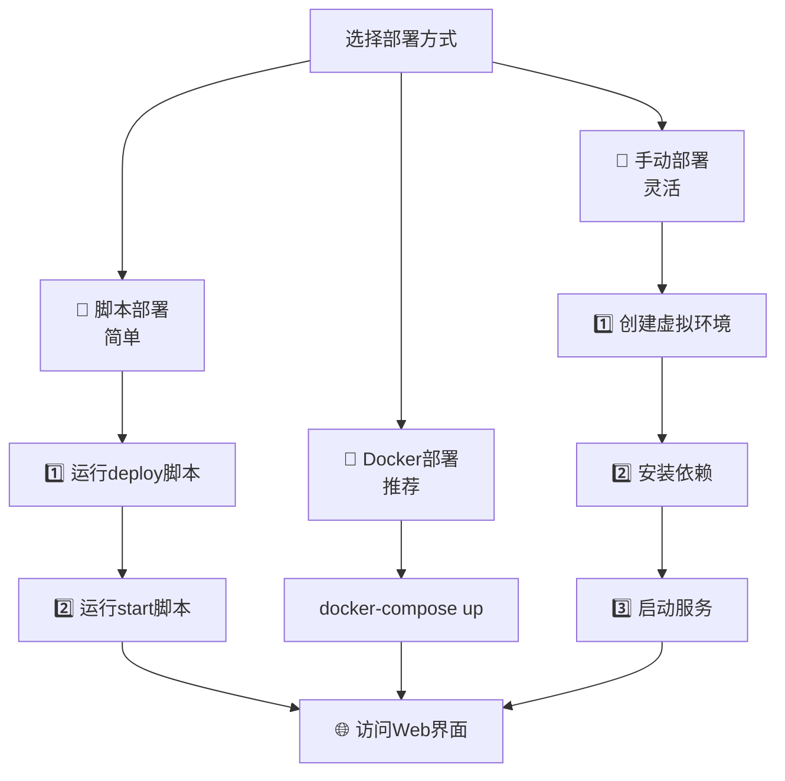

# 🚀 EasyRAG - 轻量级本地知识库增强系统

<div align="center">

[](LICENSE)
[](https://python.org)
[](https://docker.com)
[]()

[中文](README.md) | [English](README_EN.md)

</div>

---

## 📖 项目简介

**EasyRAG** 是一个灵活、易用的本地知识库增强问答系统。它集成了先进的检索技术和多样化的大语言模型（LLM），能帮助用户快速构建、查询和管理本地知识库，实现精准、智能的问答体验。

### ✨ 核心特色
- 🔒 **完全本地部署** - 数据安全与私密性保障
- 🎯 **混合搜索技术** - 向量检索 + 关键词检索
- 🤖 **多模型支持** - 本地模型 + API模型
- 📚 **多格式文档** - PDF、Word、Markdown等
- 🔄 **一键部署** - Docker/脚本自动化部署

---

## 🖼️ 界面预览

<table>
<tr>
<td width="50%">

### 🏠 主界面


</td>
<td width="50%">

### 📤 文件上传


</td>
</tr>
<tr>
<td width="50%">

### 🔍 知识库检索


</td>
<td width="50%">

### 💬 智能对话


</td>
</tr>
</table>

---

## 🎯 主要功能

<table>
<tr>
<td width="50%">

### 📚 知识库管理
- ✅ 创建、更新和删除知识库
- 📄 多格式文档处理（PDF、Word、Markdown等）
- 🖼️ OCR功能识别图片文字
- 🔄 多样化分块策略

</td>
<td width="50%">

### 🔍 高级检索策略
- 🎯 **混合搜索** - 向量检索 + BM25关键词检索
- 🏆 **重排序** - 二次排序优化相关性
- 📊 可调检索参数
- 🎛️ 灵活的搜索策略

</td>
</tr>
<tr>
<td width="50%">

### 🤖 灵活的模型支持
- 🏠 **本地大模型** - DeepSeek, Qwen, Yi等
- 🌐 **API模型** - GPT, Claude等
- ⚙️ 模型参数可调
- 🔄 无缝模型切换

</td>
<td width="50%">

### 💬 智能问答与对话
- 🎯 知识库内容结合生成
- 🔄 上下文感知多轮对话
- 📊 检索结果可视化
- 🎛️ 实时参数调整

</td>
</tr>
</table>

---

## 💻 系统要求

| 项目 | 要求 | 推荐 |
|------|------|------|
| 🖥️ **操作系统** | Windows/Linux/macOS | - |
| 🐍 **Python版本** | Python 3.9+ | Python 3.10+ |
| 💾 **内存** | 8GB | 16GB+ |
| 💿 **磁盘空间** | 10GB | 20GB+ |
| 🎮 **GPU** | 可选 | NVIDIA GPU (CUDA支持) |

---

## 🚀 快速开始

### 📋 部署方式概览

<div align="center">



</div>

---

### 🐳 方式一：Docker一键部署 (⭐推荐)

> 🎯 **最简单、最稳定的部署方式**

```bash
# 1️⃣ 确保已安装 Docker 和 Docker Compose
# 2️⃣ 在项目根目录执行
docker-compose up --build -d

# 3️⃣ 访问服务
# 浏览器打开：http://localhost:7861
```

### 📜 方式二：脚本自动部署 (⭐推荐新手)

> 🎯 **两步完成：先部署，再启动**

#### 🪟 Windows用户

```cmd
# 第一步：部署环境
双击运行 deploy.bat

# 第二步：启动服务  
双击运行 start.bat

# 或者命令行运行：
deploy.bat    # 部署
start.bat     # 启动
```

#### 🐧 Linux/macOS用户

```bash
# 第一步：部署环境
chmod +x deploy.sh start.sh  # 添加执行权限
./deploy.sh                   # 自动部署

# 第二步：启动服务
./start.sh                    # 快速启动
```

### 🔧 方式三：手动部署 (高级用户)

<details>
<summary>点击展开手动部署步骤</summary>

```bash
# 1️⃣ 创建虚拟环境
python -m venv py_env

# 2️⃣ 激活虚拟环境
# Windows:
py_env\Scripts\activate
# Linux/Mac:
source py_env/bin/activate

# 3️⃣ 安装依赖
# CPU版本：
pip install -r requirements_cpu.txt
# GPU版本：
pip install -r requirements_gpu.txt

# 4️⃣ 启动服务
python app.py    # API服务器
python ui_new.py # Web界面 (新终端)
```

</details>

---

## 🎯 部署流程详解

### 📋 第一步：环境部署 (Deploy)

<table>
<tr>
<td width="33%">

#### 🐳 Docker方式
```bash
docker-compose up --build -d
```
✅ **一键完成**
- 自动下载镜像
- 创建容器
- 启动所有服务

</td>
<td width="33%">

#### 🪟 Windows脚本
```cmd
deploy.bat
```
✅ **自动化部署**
- 检查Python环境
- 创建虚拟环境
- 安装所有依赖
- 下载模型文件

</td>
<td width="33%">

#### 🐧 Linux/macOS脚本
```bash
./deploy.sh
```
✅ **智能部署**
- 环境检测
- 依赖安装
- 权限配置
- 服务准备

</td>
</tr>
</table>

### 🚀 第二步：服务启动 (Start)

<table>
<tr>
<td width="50%">

#### 🪟 Windows启动
```cmd
start.bat
```
🎯 **功能特性**
- 🔌 自动激活虚拟环境
- 📋 加载环境配置
- 🚀 启动API服务
- 🌐 打开Web界面

</td>
<td width="50%">

#### 🐧 Linux/macOS启动
```bash
./start.sh
```
🎯 **功能特性**
- 🔌 自动激活虚拟环境
- 📋 加载.env配置
- 🚀 启动知识库系统
- 🎨 彩色终端输出

</td>
</tr>
</table>

---

## 🌐 访问服务

部署完成后，通过以下地址访问：

<div align="center">

| 服务 | 地址 | 说明 |
|------|------|------|
| 🌐 **Web界面** | `http://localhost:7861` | 主要操作界面 |
| 📚 **API文档** | `http://localhost:8000/docs` | 接口文档 |
| 🔧 **API服务** | `http://localhost:8000` | 后端API |

</div>

---

## 📖 使用说明

### 🏗️ 创建知识库

1. 🌐 访问Web界面 → 📚 "知识库管理"选项卡
2. ➕ 点击"创建知识库" → 📝 输入名称
3. ⚙️ 选择Embedding模型和分块策略
4. 📤 上传文档（支持拖拽）或粘贴文本
5. ⏳ 系统自动处理并构建索引

### 💬 知识库问答

1. 🌐 选择"知识库对话"选项卡
2. 📚 左侧选择已创建的知识库
3. 🤖 右侧选择大语言模型
4. ⚙️ 调整检索策略和模型参数
5. 💬 输入问题并获得智能回答

---

## 🏗️ 系统架构

```
EasyRAG/
├── 🐳 docker-compose.yml     # Docker部署配置
├── 🚀 app.py                 # FastAPI后端服务
├── 🌐 ui_new.py              # Gradio前端界面
├── 📜 deploy.bat/deploy.sh   # 自动部署脚本
├── 🚀 start.bat/start.sh     # 快速启动脚本
├── 📚 core/                  # 核心功能模块
│   ├── 📄 kb_doc_process.py  # 文档处理与分块
│   ├── 🔍 kb_retriever.py    # 检索模块
│   ├── 🏆 kb_reranker.py     # 重排模块
│   └── 🤖 llm_interface.py   # LLM统一接口
└── 📋 requirements*.txt      # 依赖文件
```

---

## 🔧 技术细节

### 🤖 模型支持

<table>
<tr>
<td width="33%">

#### 📊 Embedding模型
- 🎯 **默认**: `bge-m3`
- 🔄 支持切换其他模型
- 📈 高质量文本向量化
- 🚀 自动下载缓存

</td>
<td width="33%">

#### 🧠 大语言模型
- 🏠 **本地**: DeepSeek, Qwen, Yi
- 🌐 **API**: GPT, Claude等
- ⚙️ 参数实时调整
- 🔄 无缝模型切换

</td>
<td width="33%">

#### 🏆 重排模型
- 🎯 **默认**: `bge-reranker-base`
- 📈 二次排序优化
- 🎯 提升检索精度
- 🚀 自动下载缓存

</td>
</tr>
</table>

### 🔍 检索与分块

#### 🎯 检索策略
- 🔍 **向量检索** - 语义相似度匹配
- 🔤 **关键词检索** - BM25算法
- 🎯 **混合搜索** - 结合两种方式
- 🏆 **重排序** - 精确度优化

#### 📄 分块策略
- 🧠 **语义分块** - 语义边界划分
- 🔤 **递归字符分块** - 字符级别分块
- 📝 **Markdown分块** - 基于标题结构
- 📚 **子标题分块** - 技术文档优化

---

## 🚨 重要提醒

### ⚠️ Faiss向量库安装

> 📢 **注意**: 手动或脚本安装时，Faiss可能因编译问题失败

```bash
# CPU版本
pip install faiss-cpu

# GPU版本  
pip install faiss-gpu
```

💡 **解决方案**: Docker部署已包含此依赖，推荐使用Docker方式

---

## 🔧 问题排查

### 🐳 Docker用户
- ✅ 检查Docker服务状态
- 🔍 查看容器日志: `docker-compose logs`
- 🔄 重新构建: `docker-compose up --build`

### 📜 脚本用户
- 🌐 检查网络连接（下载模型需要）
- 💿 确保磁盘空间充足（>10GB）
- 📋 查看命令行错误信息
- 🔍 验证Faiss安装: `pip list | grep faiss`

### 🔧 常见问题

<details>
<summary>🐧 Linux OpenCV依赖错误</summary>

```bash
# Ubuntu/Debian
sudo apt-get update
sudo apt-get install libgl1-mesa-glx libglib2.0-0

# CentOS/RHEL
sudo yum install mesa-libGL glib2
```

</details>

<details>
<summary>🪟 Windows路径问题</summary>

- 确保路径中无中文字符
- 以管理员权限运行脚本
- 检查Python路径配置

</details>

<details>
<summary>🚀 服务启动失败</summary>

- 检查端口占用: `netstat -an | findstr 8000`
- 查看日志文件
- 重新运行部署脚本

</details>

---

## 📄 许可证

本项目采用 [MIT License](LICENSE) 许可证。

---

## 🤝 贡献

欢迎提交Issue和Pull Request！

---

## 📞 支持

如有问题，请：
1. 📋 查看本文档的问题排查部分
2. 🐛 提交Issue到GitHub
3. 💬 加入讨论群组

---

<div align="center">

### 🌟 如果这个项目对您有帮助，请给我们一个Star！⭐

**Made with ❤️ by EasyRAG Team**

</div>