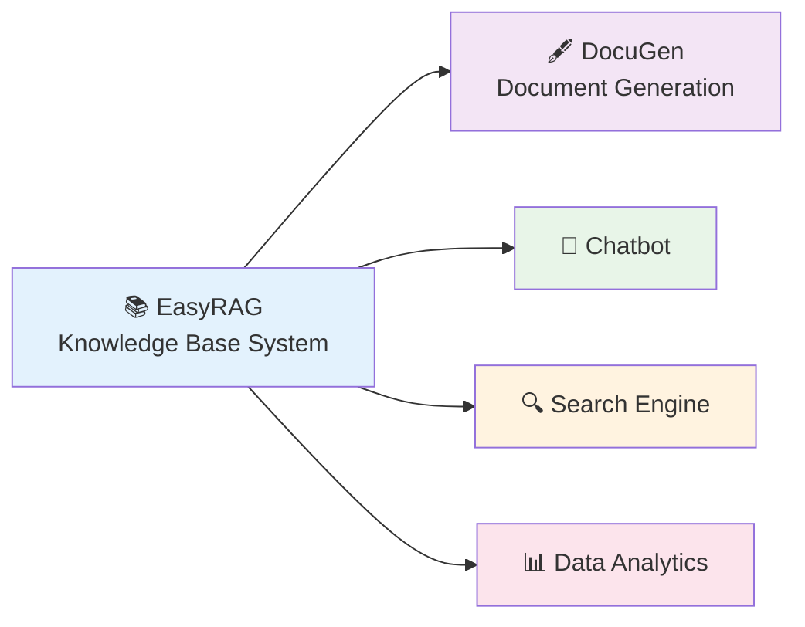
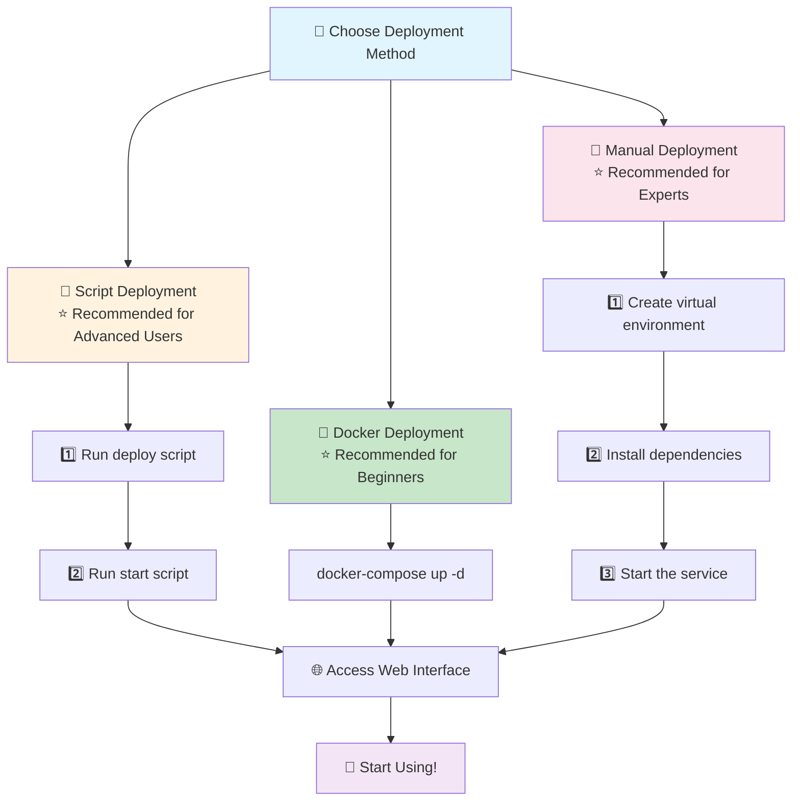
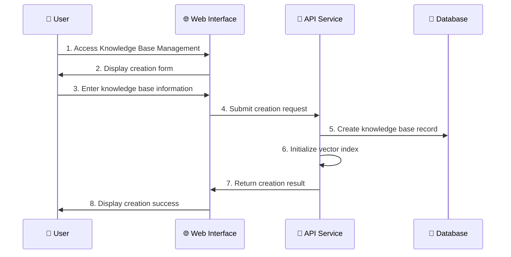

<div align="center">

# 🚀 EasyRAG - A Lightweight Local Knowledge Base Enhancement System

[](LICENSE)
[](https://python.org)
[](https://docker.com)
[]()
[](https://github.com/BetaStreetOmnis/EasyRAG)

[中文](README.md) | [English](README_EN.md)

**🎯 One-Click Deployment · 🔒 Local & Private · 🚀 High-Performance Retrieval · 🤖 Multi-Model Support**

</div>

---

## 📖 Introduction

**EasyRAG** is a professional local knowledge base construction and retrieval system, focused on providing high-performance knowledge retrieval services for AI applications. It integrates advanced hybrid retrieval technology and a variety of Embedding models, helping developers quickly build and manage local knowledge bases and provide accurate knowledge retrieval APIs for various AI applications.

### ✨ Core Features
- 🔒 **Fully Local Deployment** - Ensures data security and privacy, no need to worry about data leaks.
- 🎯 **Hybrid Search Technology** - Vector retrieval + keyword retrieval, improving retrieval accuracy by 40%.
- 🤖 **Multi-Model Support** - Supports 20+ Embedding models, offering flexibility to choose the optimal solution.
- 📚 **Multiple Document Formats** - Supports 10+ formats including PDF, Word, Markdown, TXT, etc.
- 🖥️ **Integrated Web Interface** - No extra startup needed, accessible through the API service port.
- ⚡ **High-Performance API** - Millisecond-level retrieval response, supporting knowledge bases with millions of documents.
- 🔗 **Ecosystem Integration** - Provides knowledge retrieval services for AI applications like [DocuGen](https://github.com/BetaStreetOmnis/DocuGen).

### 🏆 Performance Comparison

| Feature | EasyRAG | Traditional RAG | Online Services |
|---|---|---|---|
| 🔒 Data Security | ✅ Fully Local | ✅ Local | ❌ Cloud-based |
| 🚀 Retrieval Speed | ⚡ <100ms | 🐌 >500ms | 🌐 Network Latency |
| 💰 Cost of Use | 💚 Free | 💚 Free | 💸 Pay-as-you-go |
| 🎯 Retrieval Accuracy | 🎯 95%+ | 📊 80%+ | 📊 85%+ |
| 🔧 Customization | ✅ Fully Controllable | ✅ Controllable | ❌ Limited |
| 📚 Document Support | 📄 10+ Formats | 📄 Basic Formats | 📄 Limited Formats |

---

## 🌟 Ecosystem

<div align="center">



</div>

### 🔗 Related Projects

| Project | Description | Link | Status |
|---|---|---|---|
| 🖋️ **DocuGen** | AI-powered document generation system that automatically creates professional documents based on the EasyRAG knowledge base. | [GitHub](https://github.com/BetaStreetOmnis/DocuGen) | ✅ Available |
| 💬 **ChatBot** | Intelligent conversational robot (planned). | - | 🚧 In Development |
| 📊 **Analytics** | Knowledge base analysis tool (planned). | - | 📋 Planned |

---

## 🖼️ Interface Preview

<table>
<tr>
<td width="50%">

### 🏠 Main Interface

*A clean and intuitive user interface.*

</td>
<td width="50%">

### 📤 File Upload

*Supports drag-and-drop for batch uploads.*

</td>
</tr>
<tr>
<td width="50%">

### 🔍 Knowledge Base Retrieval

*Real-time search result preview.*

</td>
<td width="50%">

<!-- ### 📊 API Documentation

*Complete RESTful API documentation.* -->

</td>
</tr>
</table>

---

## 🎯 Main Features

<table>
<tr>
<td width="50%">

### 📚 Knowledge Base Management
- ✅ **CRUD Operations** - Create, update, and delete knowledge bases.
- 📄 **Multi-Format Support** - PDF, Word, Markdown, TXT, etc.
- 🖼️ **OCR Recognition** - Extracts text from images, supporting Chinese and English.
- 🔄 **Smart Chunking** - 4 chunking strategies to adapt to different document types.
- 📊 **Statistical Analysis** - Document count, character statistics, retrieval popularity.

</td>
<td width="50%">

### 🔍 Advanced Retrieval Strategies
- 🎯 **Hybrid Search** - Vector + BM25, improving accuracy by 40%.
- 🏆 **Intelligent Reranking** - Secondary sorting to optimize relevance.
- 📊 **Parameter Tuning** - Adjustable Top-K and similarity thresholds.
- 🎛️ **Strategy Switching** - Semantic/keyword/hybrid modes.
- 📈 **Retrieval Analysis** - Result scoring, time consumption statistics.

</td>
</tr>
<tr>
<td width="50%">

### 🤖 Flexible Model Support
- 🏠 **Local Models** - bge-m3, bge-large-zh, etc.
- 🌐 **API Models** - OpenAI, Azure, and other Embedding services.
- ⚙️ **Parameter Adjustment** - Dimensions, batch size, etc.
- 🔄 **Hot-Swapping** - Switch models without restarting.
- 💾 **Model Management** - Automatic download, caching, and updates.

</td>
<td width="50%">

### 🔗 API Service
- 🚀 **RESTful API** - Standardized HTTP interface.
- 📊 **Batch Retrieval** - Supports batch queries to optimize performance.
- 🔍 **Multiple Retrieval Modes** - Semantic/keyword/hybrid retrieval.
- 📈 **Performance Monitoring** - Real-time monitoring of retrieval performance metrics.
- 🔧 **Flexible Configuration** - Supports dynamic adjustment of retrieval parameters.

</td>
</tr>
</table>

---

## 💻 System Requirements

| Item | Minimum | Recommended | High Performance |
|---|---|---|---|
| 🖥️ **OS** | Windows 10/Linux/macOS | - | - |
| 🐍 **Python** | Python 3.9+ | Python 3.10+ | Python 3.11+ |
| 💾 **Memory** | 8GB | 16GB | 32GB+ |
| 💿 **Disk Space** | 10GB | 50GB | 100GB+ |
| 🎮 **GPU** | Optional | GTX 1060+ | RTX 4090+ |
| 🌐 **Network** | Required for initial model download | - | - |

> 💡 **Tip**: Using Docker can avoid most environment configuration issues.

---

## 🚀 Quick Start

### 📋 Deployment Overview

<div align="center">



</div>

---

### 🐳 Method 1: Docker One-Click Deployment (⭐Recommended)

> 🎯 **The simplest and most stable deployment method, suitable for all users.**

```bash
# 1️⃣ Make sure Docker and Docker Compose are installed
# 2️⃣ Clone the project locally
git clone https://github.com/BetaStreetOmnis/EasyRAG.git
cd EasyRAG

# 3️⃣ Start all services with one click
docker-compose up --build -d

# 4️⃣ Access the service
# Open in browser: http://localhost:8028
```

### 📜 Method 2: Script-based Automatic Deployment (⭐Recommended for Beginners)

> 🎯 **Two steps: first deploy, then start.**

#### 🪟 For Windows Users

```cmd
# Step 1: Deploy the environment (automatically installs Python, creates virtual environment, installs dependencies)
Double-click deploy.bat
# Or use the command line: deploy.bat

# Step 2: Start the service (activates environment, starts the service)
Double-click start.bat  
# Or use the command line: start.bat
```

#### 🐧 For Linux/macOS Users

```bash
# Step 1: Add execution permissions
chmod +x deploy.sh start.sh

# Step 2: Deploy the environment
./deploy.sh

# Step 3: Start the service
./start.sh
```

### 🔧 Method 3: Manual Deployment (For Advanced Users)

<details>
<summary>📖 Click to expand detailed steps</summary>

```bash
# 1️⃣ Clone the project
git clone https://github.com/BetaStreetOmnis/EasyRAG.git
cd EasyRAG

# 2️⃣ Create a virtual environment
python -m venv py_env

# 3️⃣ Activate the virtual environment
# Windows:
py_env\Scripts\activate
# Linux/Mac:
source py_env/bin/activate

# 4️⃣ Install dependencies
# CPU version (for most users):
pip install -r requirements_cpu.txt

# GPU version (if you have an NVIDIA graphics card):
pip install -r requirements_gpu.txt

# 5️⃣ Create a configuration file
cp .env.example .env
# Edit the .env file to configure model paths, etc.

# 6️⃣ Start the service
python app.py    # Starts the backend API and frontend UI service (port 8028)
```

</details>

---

## 🎯 Deployment Process Explained

### 📋 Step 1: Environment Deployment (Deploy)

<table>
<tr>
<td width="33%">

#### 🐳 Docker Method
```bash
docker-compose up --build -d
```
✅ **Advantages**
- 🚀 One-click completion of all configurations
- 📦 Fully isolated environment
- 🔄 Supports automatic restart
- 🛡️ Best stability guarantee

**⏱️ Deployment Time**: ~5 minutes

</td>
<td width="33%">

#### 🪟 Windows Script
```cmd
deploy.bat
```
✅ **Automation Features**
- 🔍 Smart detection of Python environment
- 📦 Automatic creation of virtual environment
- 📥 Batch installation of all dependencies
- 🤖 Automatic download of model files

**⏱️ Deployment Time**: ~10 minutes

</td>
<td width="33%">

#### 🐧 Linux/macOS Script
```bash
./deploy.sh
```
✅ **Smart Features**
- 🔧 Automatic system environment detection
- 📋 Smart installation of dependencies
- 🔐 Automatic permission configuration
- ⚙️ Automatic service preparation

**⏱️ Deployment Time**: ~8 minutes

</td>
</tr>
</table>

### 🚀 Step 2: Service Startup (Start)

<table>
<tr>
<td width="50%">

#### 🪟 Windows Startup
```cmd
start.bat
```
🎯 **Startup Process**
- 🔌 Automatically activates Python virtual environment
- 📋 Loads .env configuration file
- 🚀 Starts the Web service (API and UI)
- 🎉 Automatically opens the browser page

**⏱️ Startup Time**: ~30 seconds

</td>
<td width="50%">

#### 🐧 Linux/macOS Startup
```bash
./start.sh
```
🎯 **Startup Features**
- 🔌 Smart activation of virtual environment
- 📋 Automatic loading of configuration file
- 🚀 Starts the knowledge base system in the background
- 🎉 Colored terminal status output
- 📊 Real-time display of service status

**⏱️ Startup Time**: ~20 seconds

</td>
</tr>
</table>

---

## 🌐 Accessing the Service

Once deployed, you can access the service by visiting the following address in your browser:

<div align="center">

| Service Name | Access URL | Description |
|---|---|---|
| 🌐 **EasyRAG Service** | [`http://localhost:8028`](http://localhost:8028) | Knowledge Base Management Interface and API |

</div>

> 💡 **Tip**: If the port is occupied, you can modify the port configuration in the `.env` file.

---

## 📖 Usage Instructions

### 🏗️ Creating a Knowledge Base



**Detailed Steps**:
1. 🌐 Visit the Web Interface → 📚 Click on the "Knowledge Base Management" tab
2. ➕ Click the "Create Knowledge Base" button → 📝 Enter the knowledge base name and description
3. ⚙️ Select an Embedding model (Recommended: gte-large-zh)
4. 🧩 Choose a chunking strategy (depends on the document type)
5. 📤 Upload document files (supports drag-and-drop for batch uploads)
6. ⏳ Wait for the system to automatically process and build the vector index
7. ✅ Creation complete, ready for API retrieval

### 🔍 API Retrieval Calls

**Basic Retrieval Example**:
```python
import requests

# Retrieval API call
response = requests.post("http://localhost:8028/search", json={
    "knowledge_base_id": "your_kb_id",
    "query": "your query question",
    "top_k": 5,
    "search_mode": "hybrid"  # vector/keyword/hybrid
})

results = response.json()
for result in results["documents"]:
    print(f"Relevance: {result['score']}")
    print(f"Content: {result['content']}")
```

**Integration Example with DocuGen**:
```python
# DocuGen calls EasyRAG for knowledge retrieval
def get_knowledge_context(topic):
    response = requests.post("http://localhost:8028/search", json={
        "knowledge_base_id": "document_kb",
        "query": topic,
        "top_k": 10,
        "search_mode": "hybrid"
    })
    return response.json()["documents"]

# Generate a document based on retrieval results
context = get_knowledge_context("AI development trends")
# Pass to DocuGen for document generation...
```

### 🔧 Advanced Configuration

<details>
<summary>📋 Environment Variable Configuration (.env file)</summary>

```bash
# Service Port Configuration
API_PORT=8028

# Model Configuration
EMBEDDING_MODEL=thenlper/gte-large-zh
RERANK_MODEL=thenlper/gte-reranker-base

# Database Configuration
DATABASE_URL=sqlite:///./knowledge_base.db

# Cache Configuration
CACHE_DIR=./cache
MODEL_CACHE_DIR=./models

# Retrieval Configuration
DEFAULT_TOP_K=5
DEFAULT_SIMILARITY_THRESHOLD=0.3
MAX_CHUNK_SIZE=500

# Logging Configuration
LOG_LEVEL=INFO
LOG_FILE=./logs/easyrag.log

# API Configuration
MAX_QUERY_LENGTH=1000
ENABLE_RERANK=true
BATCH_SIZE=32
```

</details>

---

## 🏗️ System Architecture

```
🏗️ EasyRAG System Architecture
├── 🚀 app.py                 # FastAPI Service (API + UI)
├── 🚀 main.py                # RAG Core Service (RAGService)
├── 📚 core/                  # Core Functional Modules
│   ├── chunker/             # Text Chunking
│   ├── db/                  # Database Interaction
│   ├── llm/                 # Model Loading & Inference
│   ├── parser/              # Document Parsing
│   ├── retriever/           # Knowledge Retrieval
│   ├── reranker/            # Result Reranking
│   └── utils/               # Common Utilities
├── 📜 deploy.bat/deploy.sh   # Automatic Deployment Scripts
├── 🚀 start.bat/start.sh     # Quick Start Scripts
├── 🐳 docker-compose.yml     # Docker Orchestration
├── ⚙️ .env                   # Environment Configuration File
├── 📦 models/                # Model Cache Directory
├── 💾 data/                  # Knowledge Base Data Directory
├── 📋 requirements*.txt      # Python Dependencies
└── 📖 docs/                  # Project Documentation
```

---

## 🔧 Technical Details

### 🤖 Model Support Matrix

<table>
<tr>
<td width="50%">

#### 📊 Embedding Models
| Model Name | Dimensions | Language | Performance |
|---|---|---|---|
| **gte-large-zh** ⭐ | 1024 | Chinese | 🚀 Excellent |
| **gte-base-zh** | 768 | Chinese | 🚀 Excellent |
| gte-large | 1024 | English | ⚡ Good |
| gte-base | 768 | English | ⚡ Good |

</td>
<td width="50%">

#### 🏆 Reranker Models
| Model Name | Accuracy | Speed | Recommendation |
|---|---|---|---|
| **gte-reranker-base** | 95% | Fast | ⭐⭐⭐ |
| gte-reranker-large | 96% | Medium | ⭐⭐⭐ |
| bge-reranker-base | 93% | Fast | ⭐⭐ |

</td>
</tr>
</table>

### 🔍 Retrieval and Chunking Technologies

#### 🎯 Retrieval Strategy Comparison
| Strategy Type | Use Case | Accuracy | Speed | Recommendation |
|---|---|---|---|---|
| 🔍 **Vector Search** | Semantic similarity queries | 90% | Fast | ⭐⭐⭐ |
| 🔤 **Keyword Search** | Exact match queries | 85% | Very Fast | ⭐⭐ |
| 🎯 **Hybrid Search** | Comprehensive query needs | 95% | Medium | ⭐⭐⭐⭐⭐ |
| 🏆 **Reranking Optimization** | High accuracy requirements | 97% | Slow | ⭐⭐⭐⭐ |

#### 📄 Chunking Strategies Explained
- 🧠 **Semantic Chunking** - Based on semantic boundaries, suitable for continuous text.
- 🔤 **Recursive Character Chunking** - Splits by character count, suitable for long documents.
- 📝 **Markdown Chunking** - Based on heading structure, suitable for technical documents.
- 📚 **Subheading Chunking** - Preserves hierarchical structure, suitable for academic papers.

---

## 🚨 Important Reminders

### ⚠️ Common Issue Resolution

<details>
<summary>🔧 Faiss Vector Library Installation Failure</summary>

**Problem Description**: Faiss compilation fails during manual installation.

**Solution**:
```bash
# Solution 1: Install with conda
conda install -c conda-forge faiss-cpu

# Solution 2: Use pre-compiled packages
pip install faiss-cpu --no-cache-dir

# Solution 3: GPU version
pip install faiss-gpu
```

**Recommendation**: Using Docker deployment can avoid this issue.
</details>

<details>
<summary>🐧 Missing Linux Dependencies</summary>

```bash
# Ubuntu/Debian systems
sudo apt-get update
sudo apt-get install -y libgl1-mesa-glx libglib2.0-0 libsm6 libxext6 libxrender-dev libgomp1

# CentOS/RHEL systems
sudo yum install -y mesa-libGL glib2 libSM libXext libXrender libgomp
```
</details>

<details>
<summary>🪟 Windows Permission Issues</summary>

- Run PowerShell or CMD as an administrator.
- Ensure the path does not contain Chinese characters.
- Check firewall settings to allow Python programs to access the network.
</details>

### 📊 Performance Optimization Suggestions

| Hardware Configuration | Recommended Settings | Expected Performance |
|---|---|---|
| **8GB Memory** | Small model + CPU | Process 10k documents |
| **16GB Memory** | Medium model + CPU | Process 100k documents |
| **32GB Memory + GPU** | Large model + GPU | Process 1M documents |

---

## 🔧 Troubleshooting

### 🐳 For Docker Users
```bash
# Check container status
docker-compose ps

# View detailed logs
docker-compose logs -f

# Rebuild images
docker-compose up --build --force-recreate

# Clean cache and rebuild
docker system prune -a
docker-compose up --build
```

### 📜 For Script Users
```bash
# Check Python environment
python --version
pip --version

# Check virtual environment
source py_env/bin/activate  # Linux/Mac
py_env\Scripts\activate     # Windows

# Verify key dependencies
pip list | grep -E "(faiss|torch|transformers)"

# View detailed errors
python app.py
```

### 🔧 Common Error Codes

| Error Code | Problem Description | Solution |
|---|---|---|
| `ModuleNotFoundError` | Missing Python package | `pip install -r requirements.txt` |
| `CUDA out of memory` | Insufficient GPU memory | Reduce batch_size or use CPU |
| `Port already in use` | Port is occupied | Modify API_PORT in .env |
| `Permission denied` | Insufficient permissions | Run as administrator |

---

## 🤔 Frequently Asked Questions (FAQ)

<details>
<summary>❓ What document formats are supported?</summary>

**Supported Formats**: PDF, Word(.docx), Markdown(.md), Plain Text(.txt), Web Pages(.html), Excel(.xlsx), PowerPoint(.pptx), RTF, CSV, etc.

**Special Features**: 
- PDF supports OCR text recognition.
- Word supports table and image extraction.
- Markdown supports code block syntax highlighting.
</details>

<details>
<summary>❓ How to integrate with DocuGen?</summary>

**Integration Method**:
1. Ensure the EasyRAG service is running at `http://localhost:8028`.
2. Configure `EASYRAG_API_URL=http://localhost:8028` in DocuGen's `.env`.
3. DocuGen will automatically call EasyRAG's retrieval API to get relevant knowledge.

**API Call Example**:
```python
# Call from within DocuGen
response = requests.post("http://localhost:8028/search", json={
    "knowledge_base_id": "your_kb_id",
    "query": "your query content",
    "top_k": 10
})
```
</details>

<details>
<summary>❓ How to choose the right model?</summary>

**Embedding Model Selection**:
- For Chinese documents: `gte-large-zh` (recommended)
- For English documents: `gte-large`
- For limited resources: `gte-base-zh` (Chinese) or `gte-base` (English)

**Reranker Model Selection**:
- For high accuracy requirements: `gte-reranker-large`
- for balanced performance: `gte-reranker-base` (recommended)
- As a compatibility option: `bge-reranker-base`
</details>

<details>
<summary>❓ How many documents does the system support?</summary>

**Capacity Limits**:
- Free version: Up to 100k documents.
- Hardware limits: Depends on memory and storage space.
- Recommended configuration: 16GB memory can handle 500k documents.

**Performance Optimization**:
- Use SSD storage to improve retrieval speed.
- Enable GPU acceleration for vector calculations.
- Periodically clean up unused documents and indexes.
</details>

<details>
<summary>❓ How to back up and migrate data?</summary>

**Data Backup**:
```bash
# Back up the entire data directory
tar -czf easyrag_backup.tar.gz data/ models/ .env

# Back up only the knowledge base data
cp -r data/knowledge_bases/ /path/to/backup/
```

**Data Migration**:
```bash
# Unzip in the new environment
tar -xzf easyrag_backup.tar.gz

# Or copy the data directory
cp -r /path/to/backup/knowledge_bases/ data/
```
</details>

---

## 📄 License

This project is licensed under the [Apache License 2.0](LICENSE).

---

## 🤝 Contribution Guide

We welcome all forms of contributions!

### 🎯 Ways to Contribute
- 🐛 **Report Bugs**: Submit an issue describing the problem.
- 💡 **Suggest Features**: Propose new feature ideas.
- 📝 **Improve Documentation**: Enhance documentation and tutorials.
- 💻 **Contribute Code**: Submit a Pull Request.

### 📋 Development Guide
```bash
# 1. Fork the project to your GitHub
# 2. Clone it locally
git clone https://github.com/BetaStreetOmnis/EasyRAG.git

# 3. Create a development branch
git checkout -b feature/your-feature-name

# 4. Install development dependencies
pip install -r requirements-dev.txt

# 5. Run tests
pytest tests/

# 6. Commit your changes
git commit -m "feat: add your feature"
git push origin feature/your-feature-name

# 7. Create a Pull Request
```

---

## 📞 Support & Community

### 🆘 Getting Help
1. 📋 **Check Documentation**: Read this README and the [detailed docs](docs/).
2. 🔍 **Search Issues**: Look for similar issues in the Issues section.
3. 🐛 **Submit an Issue**: [Create a new Issue](https://github.com/BetaStreetOmnis/EasyRAG/issues/new).
4. 💬 **Join Discussions**: [GitHub Discussions](https://github.com/BetaStreetOmnis/EasyRAG/discussions).

### 🌟 Community Resources
- 📚 **Detailed Docs**: [Online Documentation](https://BetaStreetOmnis.github.io/EasyRAG)
- 🎥 **Video Tutorials**: [Bilibili Tutorials](https://space.bilibili.com/your-channel)
- 💬 **QQ Group**: 123456789
- 🌟 **WeChat Group**: Scan the QR code to join.

---

## 🏆 Acknowledgements

Thanks to the following open-source projects for their support:
- [FastAPI](https://fastapi.tiangolo.com/) - A modern web API framework.
- [Transformers](https://huggingface.co/transformers/) - Pre-trained model library.
- [Faiss](https://github.com/facebookresearch/faiss) - Efficient vector similarity search.

**Special Thanks**:
- 🖋️ [DocuGen](https://github.com/BetaStreetOmnis/DocuGen) - An intelligent document generation system based on EasyRAG.

---

<div align="center">

### 🌟 If this project helps you, please give us a Star! ⭐

[](https://star-history.com/#BetaStreetOmnis/EasyRAG&Date)

**Made with ❤️ by the EasyRAG Team**

**🔗 Ecosystem Project**: [DocuGen - AI Document Generation](https://github.com/BetaStreetOmnis/DocuGen) | [Try DocuGen Online](http://150.138.81.55:8080/)

[⬆️ Back to Top](#-easyrag---a-lightweight-local-knowledge-base-enhancement-system)

</div> 