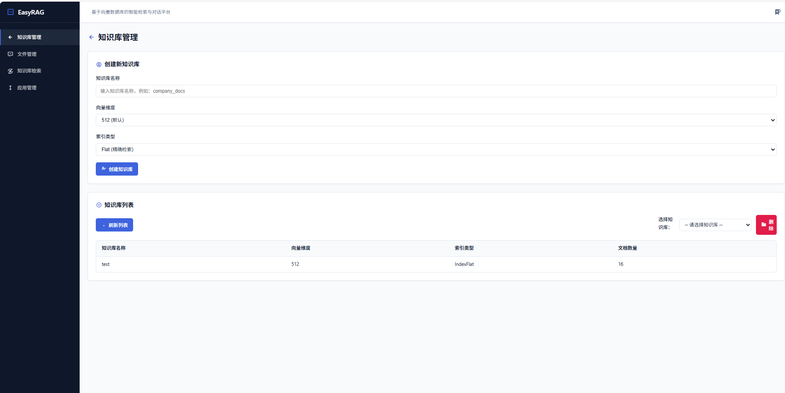
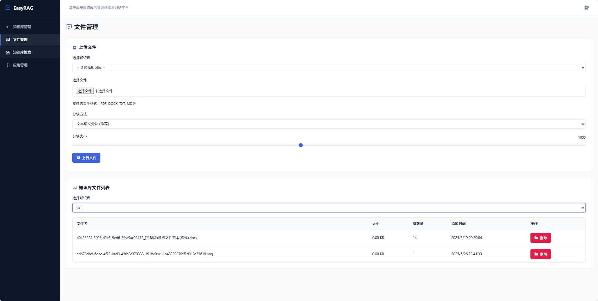
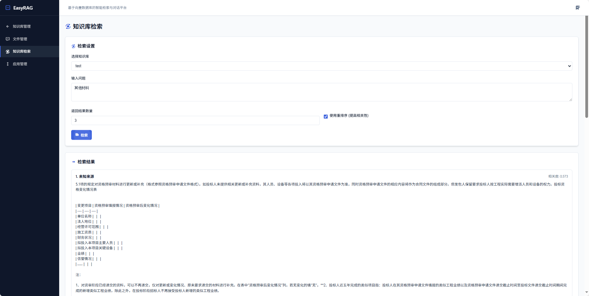
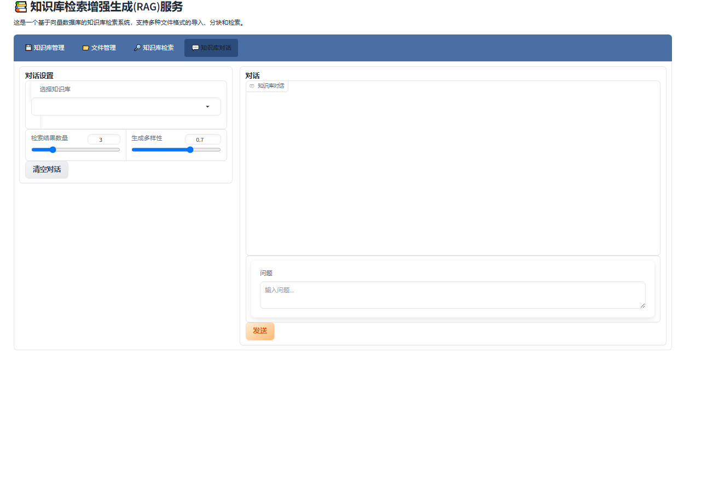

# EasyRAG - 轻量级本地知识库增强系统

[English](README_EN.md) | [中文](README.md)

### 项目简介
EasyRAG是一个基于向量数据库的轻量级知识库检索系统，专为本地部署设计，对硬件要求极低。系统融合了现代数据治理理念，提供了友好的Web界面，支持多种文件格式的导入、分块和检索功能。该系统使用了检索增强生成（RAG）技术，可以有效地管理和检索大规模文档，同时确保数据的质量、安全性和可追溯性。

### 界面预览

#### 主界面


#### 文件上传


#### 知识库检索


#### 智能对话


### 核心优势
- 🚀 轻量级部署
  - 支持完全本地化部署
  - 最低配置要求：4GB内存，2核CPU
  - 无需GPU，CPU即可流畅运行
  - 支持增量式资源使用
- 💡 智能文档处理
  - 自动文本分块优化
  - 智能向量索引
  - 高效检索算法
  - 低资源消耗的嵌入式计算

### 主要功能
- 📚 知识库管理
  - 创建和删除知识库
  - 自定义向量维度和索引类型
  - 实时查看知识库状态
  - 知识库元数据管理
- 📁 文件管理
  - 支持多种格式文件上传（TXT、PDF、DOCX等）
  - 文件分块配置（大小、重叠度）
  - 文件替换和删除
  - 文件版本控制与追踪
- 🔍 知识库检索
  - 语义相似度搜索
  - 支持重排序优化
  - 可配置返回结果数量
  - 检索结果溯源
- 💬 智能对话
  - 基于知识库的问答
  - 支持上下文记忆
  - 可调节回答的随机性
  - 对话历史追踪
- 🔐 数据治理
  - 数据质量控制
  - 数据生命周期管理
  - 数据访问权限控制
  - 数据使用追踪
  - 合规性保证

### 技术特点
- 基于Gradio构建的现代化Web界面
- 支持多种文本分块策略
- 实时进度显示
- 响应式设计，支持移动端访问
- 完整的数据治理框架
  - 数据标准化处理
  - 数据质量监控
  - 数据血缘关系追踪
  - 数据安全保护机制
- 优化的本地计算
  - 高效的向量计算
  - 智能的资源调度
  - 渐进式加载机制
  - 缓存优化策略

### 数据治理亮点
- 数据全生命周期管理
  - 数据采集：支持多源数据接入，确保数据质量
  - 数据处理：标准化处理流程，保证数据一致性
  - 数据存储：安全可靠的存储机制，支持数据加密
  - 数据使用：访问控制和审计，确保数据安全
  - 数据归档：自动化归档策略，优化存储空间
- 数据质量保证
  - 自动化质量检测
  - 数据清洗和标准化
  - 异常数据识别和处理
  - 数据更新机制
- 数据安全与隐私
  - 细粒度访问控制
  - 数据脱敏处理
  - 操作日志记录
  - 合规性检查

### 快速开始
1. 安装依赖：
```bash
pip install -r requirements.txt
```

2. 启动API服务器：
```bash
python api_server.py
```

3. 启动Web界面：
```bash
python ui_new.py
```

4. 访问界面：
打开浏览器访问 `http://localhost:7861`

### 系统要求
- 操作系统：Windows/Linux/MacOS
- CPU：2核及以上
- 内存：4GB及以上（推荐8GB）
- 硬盘空间：10GB及以上（取决于知识库大小）
- Python版本：3.8及以上

### 使用说明
1. 确保API服务器（api_server.py）正在运行
2. 首先创建一个知识库
3. 上传文件到知识库，系统会自动进行数据质量检查
4. 使用检索或对话功能访问知识库内容，所有操作都有完整的追踪记录
5. 在管理界面查看数据使用情况和治理报告

### 性能优化建议
- 根据实际需求调整分块大小
- 使用SSD存储可提升检索速度
- 适当增加系统内存可提升并发处理能力
- 定期清理缓存优化存储空间